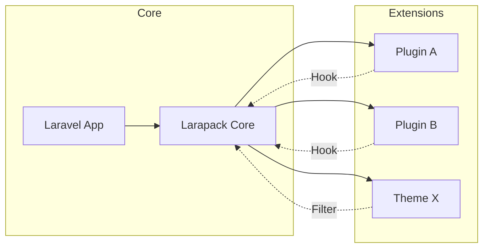

# Larapack: WordPress-like Extensibility for Laravel

## 1. Executive Summary
Larapack is a framework extension for Laravel that implements a robust, hook-based plugin and theme system modeled after WordPress. It provides a structured way to extend core functionality, swap visual presentations, and maintain a decoupled architecture.

## 2. Core Philosophy
- **Non-Invasive**: Extend the application without modifying `/app`, `/config`, or `/routes` of the core Laravel installation.
- **Hook-Driven**: Interaction between components happens through Actions (events) and Filters (data modification).
- **Service-Oriented**: Plugins and themes can register their own Service Providers, Routes, and Middleware.

## 3. System Components

### A. The System Core (`system.md`)
The backbone handles the lifecycle:
- **Bootstrapping**: Resolves active plugins and the current theme during the Laravel boot process.
- **Hook System**: A central dispatcher for `addAction` and `applyFilters`.
- **Managers**: `PluginManager` and `ThemeManager` handle registration, activation, and deactivation.
- **Database**: Standard tables for managing state (`plugins`, `themes`).

### B. The Plugin System (`plugins.md`)
Plugins are self-contained packages located in `/packages/[vendor]/[plugin]`:
- **Manifest**: `plugin.json` defines metadata, namespace, and dependencies.
- **Auto-Discovery**: The system core automatically scans for vendor subdirectories and loads valid plugins.
- **Structure**: Mirrors Laravel's structure (src, routes, database, resources).
- **Hooks**: Plugins use global `add_action` and `add_filter` helpers to interact with the system.

### C. The Theme System (`themes.md`)
Themes reside in `/themes` and control the UI:
- **Hierarchy**: A standard Blade-based hierarchy (home, page, single, archive).
- **Functions**: `functions.php` serves as the theme's logic layer, registering menus and enqueuing assets.
- **Assets**: Structured management of CSS, JS, and image assets.
- **Customization**: Integration with a "Customizer" for user-defined settings.

## 4. AI Prompt Strategy: Getting Started
To share this structure with an AI model, provide it with the three primary files in this order:
1. `system.md` - To understand the overall architecture and request lifecycle.
2. `plugins.md` - To understand how to build and integrate functionality.
3. `themes.md` - To understand how to build and integrate visual designs.

## 5. Integration Map

