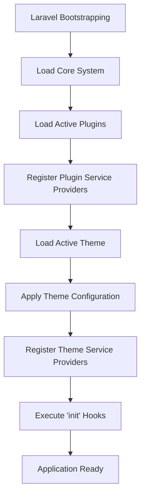
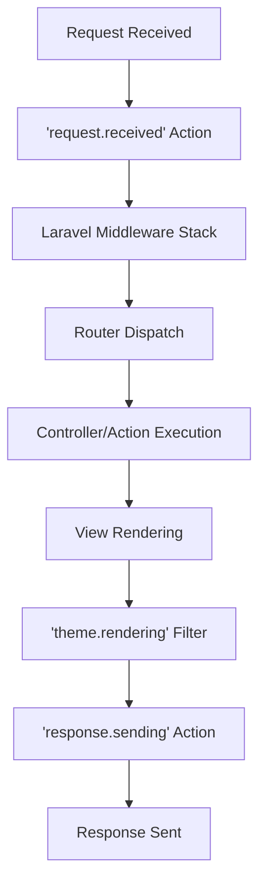
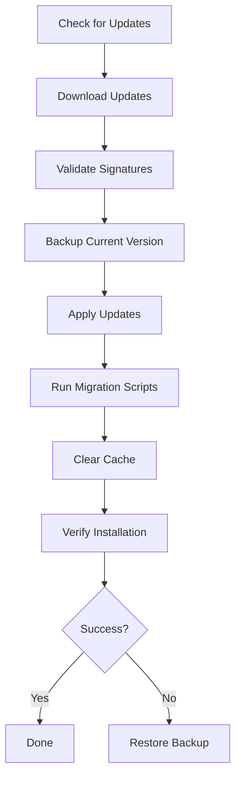

# Laravel Plugin & Theme System

## Overview
A WordPress-like extensibility system for Laravel applications that allows dynamic loading of plugins and themes without modifying core code.

## System Architecture

### core components

```text
app/Core/
├── PluginManager.php # Manages plugin lifecycle
├── ThemeManager.php  # Manages theme lifecycle
├── HookSystem.php    # Action/Filter system
├── EventSystem.php   # Extended Laravel events
└── ServiceManager.php # Service provider management
```


### directory structure

```text
laravel-app/
├── app/
│   ├── Core/           # System core files (HookSystem, Managers)
│   └── Providers/
│       └── ExtensibilityServiceProvider.php
├── packages/           # User plugins directory (vendor-nested)
├── themes/             # User themes directory
├── bootstrap/
│   └── providers.php   # Service provider list
└── config/
```


## Installation & Setup

### 1. Register Service Provider
Add the provider to `bootstrap/providers.php`:
```php
return [
    App\Providers\AppServiceProvider::class,
    App\Providers\ExtensibilityServiceProvider::class,
];
```

### 2. Configure Plugin/Theme Directories
Ensure `packages/` and `themes/` directories exist in your root.

## System Flow

### Application Bootstrap Sequence



### Request Lifecycle



## Hook System

### Available Hooks

#### System Hooks
- `system.init`: After system initialization
- `system.booted`: After application boot
- `system.shutdown`: Before application shutdown

#### Request Hooks
- `request.received`: When request is received
- `request.routed`: After route is matched
- `request.validated`: After request validation

#### Database Hooks
- `db.query.executing`: Before query execution
- `db.query.executed`: After query execution
- `db.model.saving`: Before model save
- `db.model.saved`: After model save

#### View Hooks
- `view.composing`: Before view is composed
- `view.rendering`: Before view is rendered
- `view.rendered`: After view is rendered

#### Hook Usage Examples
```php
// Adding an action using global helper
add_action('admin_menu', function($menu) {
    // Logic
});

// Applying filters using global helper
$content = apply_filters('the_content', $post->content);
```

Service Management
Plugin Service Registration
php

// In plugin service provider
public function register()
{
    $this->app->singleton('myplugin.service', function($app) {
        return new MyPluginService();
    });
}

Theme Service Registration
php

// In theme service provider
public function register()
{
    $this->app->bind('theme.view.finder', function($app) {
        return new ThemeViewFinder($app['files'], $app['config']['view.paths']);
    });
}

Configuration Management
System Configuration
php

// config/plugins.php
return [
    'paths' => [
        'plugins' => base_path('packages'),
        'themes' => base_path('themes'),
    ],
    
    'cache' => [
        'enabled' => env('PLUGIN_CACHE', true),
        'key' => 'plugin_system',
        'ttl' => 3600,
    ],
    
    'auto_discover' => true,
];

Environment Variables
env

PLUGIN_AUTO_LOAD=true
PLUGIN_CACHE=true
THEME_DEFAULT=my-theme
THEME_FALLBACK=default
PLUGIN_UPDATE_URL=https://plugins.example.com

Security Model
### Permission Levels
1. **Core**: Full system access
2. **Plugin**: Plugin-specific resources
3. **Theme**: View/assets only
4. **Guest**: Read-only access

Security Policies
php

class PluginSecurityPolicy
{
    public function before(User $user, $ability)
    {
        if ($user->hasRole('super-admin')) {
            return true;
        }
    }
    
    public function install(User $user): bool
    {
        return $user->can('install plugins');
    }
    
    public function activate(User $user, Plugin $plugin): bool
    {
        return $user->can('activate plugins') && 
               !$plugin->requiresPremium() ||
               $user->subscribed();
    }
}

Update System
### Update Flow



Update Configuration
php

// config/updates.php
return [
    'channel' => env('UPDATE_CHANNEL', 'stable'),
    'check_interval' => 86400, // 24 hours
    'auto_update' => false,
    'backup_before_update' => true,
];

Error Handling
### Exception Hierarchy

```text
ExtensibilityException
├── PluginException
│   ├── PluginNotFoundException
│   ├── PluginActivationException
│   └── PluginDependencyException
├── ThemeException
│   ├── ThemeNotFoundException
│   └── ThemeActivationException
└── HookException
    ├── HookNotFoundException
    └── HookCallbackException
```

Error Recovery
php

try {
    $pluginManager->activate($plugin);
} catch (PluginDependencyException $e) {
    // Show dependency error
    return redirect()->back()->withErrors([
        'dependencies' => $e->getMissingDependencies()
    ]);
} catch (PluginException $e) {
    // Log and show generic error
    Log::error('Plugin activation failed', [
        'plugin' => $plugin->name,
        'error' => $e->getMessage()
    ]);
}

Performance Optimization
Caching Strategy
php

class PluginCache
{
    protected function getCacheKey(): string
    {
        return 'plugins.active.' . md5(implode('', $this->getActivePluginNames()));
    }
    
    protected function cacheActivePlugins(): void
    {
        Cache::remember($this->getCacheKey(), 3600, function() {
            return $this->loadActivePlugins();
        });
    }
}

Lazy Loading
php

class LazyPluginLoader
{
    protected $loaded = [];
    
    public function loadWhen($condition, $plugin)
    {
        if ($condition() && !isset($this->loaded[$plugin])) {
            $this->loadPlugin($plugin);
            $this->loaded[$plugin] = true;
        }
    }
}

### Database Schema

```sql
-- Plugins table
CREATE TABLE `plugins` (
    `id` INT PRIMARY KEY AUTO_INCREMENT,
    `name` VARCHAR(191) UNIQUE NOT NULL,
    `namespace` VARCHAR(191) UNIQUE NOT NULL,
    `version` VARCHAR(20) NOT NULL,
    `status` ENUM('active', 'inactive', 'broken') DEFAULT 'inactive',
    `settings` JSON,
    `created_at` TIMESTAMP,
    `updated_at` TIMESTAMP
);

-- Themes table
CREATE TABLE `themes` (
    `id` INT PRIMARY KEY AUTO_INCREMENT,
    `name` VARCHAR(191) UNIQUE NOT NULL,
    `slug` VARCHAR(191) UNIQUE NOT NULL,
    `parent_id` INT NULL,
    `is_active` BOOLEAN DEFAULT FALSE,
    `settings` JSON,
    `created_at` TIMESTAMP,
    `updated_at` TIMESTAMP,
    FOREIGN KEY (`parent_id`) REFERENCES `themes`(`id`)
);
```

### API Endpoints

#### System API
```text
GET    /api/system/health          # System health check
GET    /api/system/info            # System information
GET    /api/system/hooks           # List registered hooks
POST   /api/system/cache/clear     # Clear system cache
```

#### Plugin API
```text
GET    /api/plugins                # List plugins
POST   /api/plugins                # Install plugin
PUT    /api/plugins/{id}           # Update plugin
DELETE /api/plugins/{id}           # Uninstall plugin
POST   /api/plugins/{id}/activate  # Activate plugin
POST   /api/plugins/{id}/deactivate # Deactivate plugin
```

#### Theme API
```text
GET    /api/themes                 # List themes
POST   /api/themes/{id}/activate   # Activate theme
GET    /api/themes/{id}/preview    # Preview theme
```

### Command Line Interface

#### System Commands
```bash
# System information
php artisan system:info
php artisan system:hooks

# Cache management
php artisan plugin:cache
php artisan plugin:clear-cache

# Diagnostics
php artisan plugin:diagnose
php artisan theme:diagnose
```

#### Update Commands
```bash
# Check for updates
php artisan plugin:check-updates
php artisan theme:check-updates

# Apply updates
php artisan plugin:update-all
php artisan theme:update {theme}

# Rollback updates
php artisan plugin:rollback {plugin}
```

Monitoring & Logging
Log Channels
php

// config/logging.php
'channels' => [
    'plugins' => [
        'driver' => 'daily',
        'path' => storage_path('logs/plugins.log'),
        'level' => 'debug',
    ],
    'themes' => [
        'driver' => 'daily',
        'path' => storage_path('logs/themes.log'),
        'level' => 'debug',
    ],
],

Monitoring Metrics
php

class SystemMonitor
{
    protected function collectMetrics(): array
    {
        return [
            'plugins' => [
                'total' => Plugin::count(),
                'active' => Plugin::where('status', 'active')->count(),
                'loaded' => count(app('plugin.manager')->getLoaded()),
            ],
            'hooks' => [
                'registered' => count(HookSystem::getRegistered()),
                'executed' => HookSystem::getExecutionCount(),
            ],
            'performance' => [
                'load_time' => microtime(true) - LARAVEL_START,
                'memory_usage' => memory_get_peak_usage(true),
            ],
        ];
    }
}

### Best Practices

#### Development Guidelines
- Always use namespaces to avoid conflicts
- Implement proper error handling
- Use the hook system instead of modifying core files
- Follow semantic versioning for plugins/themes
- Write comprehensive documentation

#### Security Guidelines
- Validate all user inputs
- Use prepared statements for database queries
- Implement proper authorization checks
- Sanitize output data
- Keep dependencies updated

#### Performance Guidelines
- Implement caching where appropriate
- Use lazy loading for non-essential features
- Optimize database queries
- Minimize hook usage in loops
- Use efficient algorithms

### Troubleshooting

#### Common Issues
**Plugin Not Loading**
- Check plugin status in database
- Verify `plugin.json` format
- Check for namespace conflicts
- Review error logs

**Hook Not Firing**
- Verify hook is registered
- Check hook priority
- Ensure plugin is active
- Check for early returns

**Theme Not Applying**
- Verify theme is active
- Check template hierarchy
- Clear view cache
- Check file permissions

#### Debug Commands
```bash
# Debug plugin loading
php artisan plugin:debug {plugin}

# Debug hooks
php artisan hook:debug {hook}

# Debug theme
php artisan theme:debug {theme}
```

Support & Maintenance
Version Support
Version	Laravel	PHP	Support Until
1.0.x	9.x	8.1	2024-12-31
1.1.x	10.x	8.2	2025-06-30
2.0.x	10.x	8.3	2025-12-31
Update Policy

    Security patches: Within 48 hours

    Bug fixes: Within 7 days

    Feature updates: Monthly releases

    Major versions: Every 6 months

Migration Guide
From v1.0 to v2.0

    Backup your database

    Update composer dependencies

    Run migration scripts

    Update plugin manifests

    Clear all caches

    Test functionality

Breaking Changes

    Hook system API changes

    Database schema updates

    Configuration file structure

    Service provider registration